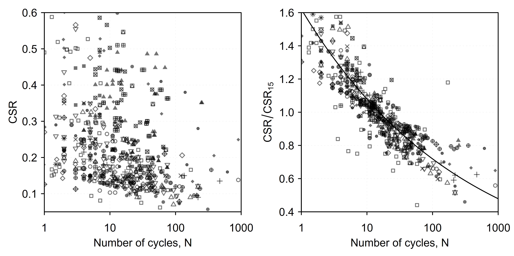
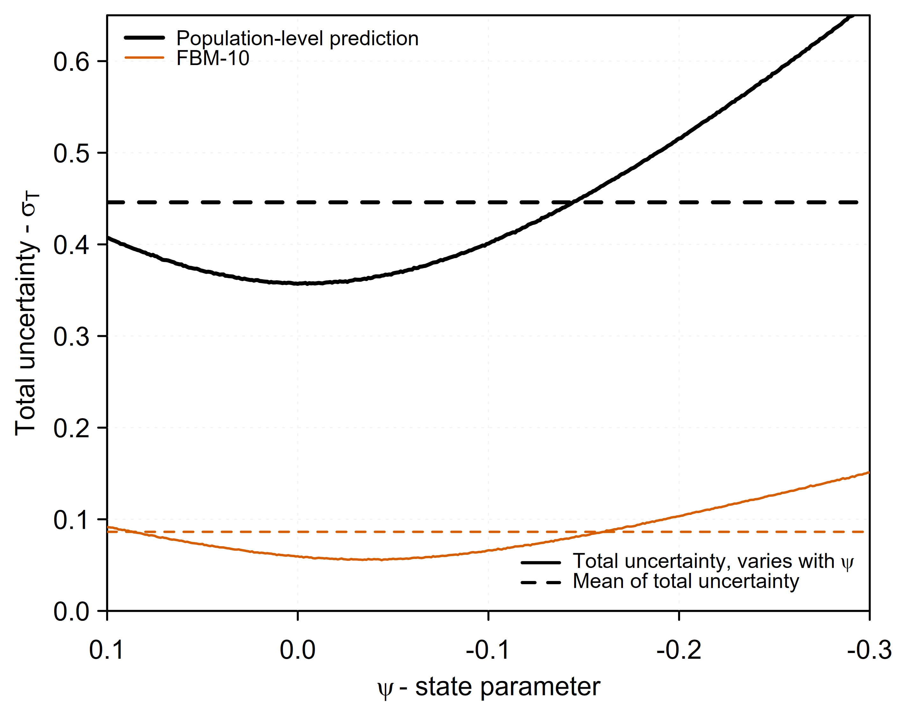

# Probabilistic State Parameter-Based Liquefaction Triggering Model

**Software, data, and documentation for a probabilistic liquefaction-triggering model formulated in state-parameter space.**

> **Publication status:** Accepted for publication in the  
> *ASCE Journal of Geotechnical and Geoenvironmental Engineering*.

---

## Overview

This repository contains the software, data, and documentation associated with the article:

### *Probabilistic State Parameter-Based Liquefaction Triggering Model*

**Authors:** Pedro Reyes, Gonzalo Montalva, Vicente San Martín, and Robb Moss.

The proposed framework combines a laboratory-derived cyclic resistance model, **CRR(ψ)**, with Monte Carlo propagation of:

- CPT-derived state parameter, **ψ**, estimated using a Plewes-type procedure.
- Probabilistic seismic demand, **CSR**.
- Laboratory-to-field stress-path correction from cyclic triaxial to direct simple shear (DSS) conditions..

The workflow produces depth-dependent estimates of the factor of safety, **FS**, and the probability of liquefaction, **P<sub>L</sub>**.

---

## Liquefaction Triggering Model

### Main package

[`CPT_to_PL.zip`](CPT_to_PL.zip)

This package reproduces the CPT-based probabilistic workflow used in the liquefaction-triggering study.

The cyclic resistance relationship, **CRR(ψ)**, is combined with Monte Carlo uncertainty propagation to calculate:

- Cone resistance, **q<sub>c</sub>**.
- Friction ratio, **R<sub>f</sub>**.
- Soil behavior type index, **I<sub>c,RW</sub>**.
- State parameter, **ψ**.
- Cyclic resistance ratio, **CRR(ψ)**.
- Factor of safety, **FS**.
- Probability of liquefaction, **P<sub>L</sub>**.

All results are presented as a function of depth.

---

## How to Use the Model

### 1. Prepare the working directory

Set the working directory to the folder containing the following files:

```text
CPT.xlsx
CRR_model.RData
CSR_model.RData
PSI_uncertainty.RData
```

Example in R:

```r
setwd("C:/Users/X/Downloads/CPT_to_PL")
```

### 2. Configure the input parameters

Edit the following required inputs:

```text
GWT
amax
Mw
n_mc
```

The following optional parameters may also be specified when site- or material-specific information is available:

```text
K0_user
Mtc_user
a_ratio_user
```

The input parameters are:

- **GWT:** groundwater-table depth, in meters.
- **amax:** peak ground acceleration.
- **Mw:** earthquake moment magnitude.
- **n_mc:** number of Monte Carlo simulations.
- **K0_user:** user-defined coefficient of earth pressure at rest.
- **Mtc_user:** user-defined critical-state stress ratio.
- **a_ratio_user:** user-defined cone area ratio.

### 3. Run the model

Run the main R script after defining the working directory and the required input parameters.

---

## Output

The model generates the following graphical output:

```text
CPT_profile_panels.png
```

The output file is saved in the working directory.

It presents depth profiles of:

- **q<sub>c</sub>**
- **R<sub>f</sub>**
- **I<sub>c,RW</sub>**
- **ψ**
- **CRR(ψ)**
- **P<sub>L</sub>**

---

## Laboratory Database

### Database file

[`Lab_Tx_Database_2026.xlsx`](Lab_Tx_Database_2026.xlsx)

This file contains the laboratory cyclic and monotonic triaxial test results, together with the associated metadata used to calibrate the model presented in the manuscript.

The database includes:

- The summary table reported in the article.
- Material properties and model parameters used in the study.
- Critical State Line data, **CSL**.
- Liquefaction Resistance Curve data, **LRC**.
- Individual worksheets containing the test results for each material.

The laboratory database compiles cyclic and monotonic triaxial information for the sands included in the study.

---

## Supplementary Materials

The supplementary figures and the complete supporting document are available in the:

[`Supplementary_Materials`](Supplementary_Materials/) directory.

The directory contains:

- [`Supplementary_Materials_GTENG-15418.pdf`](Supplementary_Materials/Supplementary_Materials_GTENG-15418.pdf)  
  Complete supplementary document containing Supplemental Figures S1 and S2.

- [`Figure_S1.png`](Supplementary_Materials/Figure_S1.png)  
  Browser-friendly preview of Supplemental Figure S1.

- [`Figure_S1.tiff`](Supplementary_Materials/Figure_S1.tiff)  
  High-resolution version of Supplemental Figure S1.

- [`Figure_S2.png`](Supplementary_Materials/Figure_S2.png)  
  Browser-friendly preview of Supplemental Figure S2.

- [`Figure_S2.tiff`](Supplementary_Materials/Figure_S2.tiff)  
  High-resolution version of Supplemental Figure S2.

### Supplemental Figure S1



**Fig. S1.** Cyclic resistance trends from compiled triaxial tests.  
**(a)** CSR versus number of cycles, *N*.  
**(b)** Normalized response CSR/CSR<sub>15</sub> versus *N*, with the best-fitting curve using the Jefferies and Been (2015) normalization.

### Supplemental Figure S2



**Fig. S2.** Total predictive uncertainty, **σ<sub>T</sub>**, as a function of the state parameter, **ψ**, comparing the population-level prediction and the material-specific calibration for FBM-10.

---

## Data Availability

The data and code required to implement the proposed model are provided in this repository.

The original laboratory, CPT-profile, and critical-layer databases used in the study were obtained from the published sources cited in the manuscript.

The repository includes:

- The laboratory triaxial database used for model calibration.
- The CPT-based liquefaction-triggering implementation.
- Model objects required for the probabilistic calculations.
- Supplementary figures associated with the manuscript.
- Documentation describing the files and workflow.

---

## Reproducibility

To reproduce the CPT-based workflow:

1. Download and extract [`CPT_to_PL.zip`](CPT_to_PL.zip).
2. Place the required input and model files in the same working directory.
3. Define the site and earthquake input parameters.
4. Run the main R script.
5. Review the generated `CPT_profile_panels.png` output.

For improved reproducibility, users should preserve the original file names and folder structure.

---

## Repository Contents

| File or directory | Description |
|---|---|
| [`CPT_to_PL.zip`](CPT_to_PL.zip) | CPT-based probabilistic liquefaction-triggering model |
| [`Lab_Tx_Database_2026.xlsx`](Lab_Tx_Database_2026.xlsx) | Laboratory cyclic and monotonic triaxial database |
| [`Supplementary_Materials`](Supplementary_Materials/) | Supplemental figures and supporting PDF |
| [`LICENSE`](LICENSE) | Repository license |
| [`README.md`](README.md) | Main repository documentation |

---

## Citation

The associated article has been accepted for publication in the:

### *ASCE Journal of Geotechnical and Geoenvironmental Engineering*

The complete bibliographic citation and DOI will be added when they become available.

Until the final citation is assigned, the repository may be referenced as:

> Reyes, P., Montalva, G., San Martín, V., and Moss, R. (2026).  
> *Probabilistic State Parameter-Based Liquefaction Triggering Model: Software, Data, and Documentation.*  
> GitHub repository.

---

## License

This repository is distributed under the **GNU General Public License v3.0**.

See the [`LICENSE`](LICENSE) file for additional information.

---

## Acknowledgments

This study was supported by Chile’s **National Agency for Research and Development, ANID**, through:

- **Becas/Magíster Nacional**, Grant **22240930**.
- **Anillo EASER — Evolution Assessment of Seismic Risk**, Grant **ACT240044**.

The authors also acknowledge the **Geotechnical Group at the Universidad de Concepción, Chile**.
